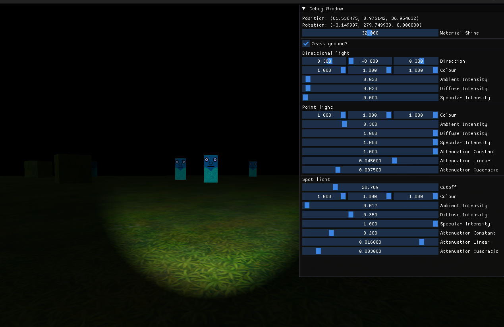

# OpenGL Spooky Scene

A """Spooky""" scene made with OpenGL, aka just some dramatic lighting and a bunch of creepy billboards.

This was made as reference on how to use OpenGL 4.5 (direct state access) to do lighting effects, framebuffers, billboarding, and model loading. For this reason, the majority of the code is in main.cpp in a procedural style to keep it as simple as possible.

The model is not included in the repo to reduce the size, (and is not actually required) but it can be downloaded from [sketchfab](https://learnopengl.com/data/models/backpack.zip) and placing it in the `assets/models` directory. The original can also downloaded in other formats [here](https://sketchfab.com/3d-models/survival-guitar-backpack-799f8c4511f84fab8c3f12887f7e6b36).

The majority of project was learned from the following:

- [LearnOpenGL](https://learnopengl.com/)
- [OGLDev](https://www.ogldev.org/)
- [Guide to Modern OpenGL Functions](https://github.com/fendevel/Guide-to-Modern-OpenGL-Functions)-
- [OpenGL 4.6 Examples](https://github.com/rtryan98/OpenGL)

## Screenshots




## Building and Running

### Windows (Visual Studio)

The easiest way to build is to use [vcpkg](https://vcpkg.io/en/index.html) and install libraries through this.

```bash
vcpkg install sfml
vcpkg install imgui
vcpkg install assimp
vcpkg install glm
vcpkg integrate install
```

Create a new visual studio C++ empty project, git clone the files, and copy them into the project directory.

Select the "Show All Files" options in Solution Explorer, and right-click on the src/ and deps/ directory, and choose the "include in project options"

Go into the project properies and under `C/C++ > General`, add the deps/ directory as an additional include directy.

Finally, under `Linker > Input`, add OpenGL32.lib as an additional dependancy.

Under "Project -> Properties -> C/C++ -> Preprocessor -> Preprocessor Definitions" add `_CRT_SECURE_NO_WARNINGS`z

### Linux

Requires conan.

```sh
python3 -m pip install conan==1.61.0
```

To build, at the root of the project:

```sh
sh scripts/build.sh install
```

The install argument is only needed for the first time compilation as this is what grabs the libraries from Conan.

So after the first time, you can simply run:

```
sh scripts/build.sh
```

To run, at the root of the project:

```sh
sh scripts/run.sh
```

To build and run in release mode, simply add the `release` suffix:

```sh
sh scripts/build.sh release
sh scripts/run.sh release
```
